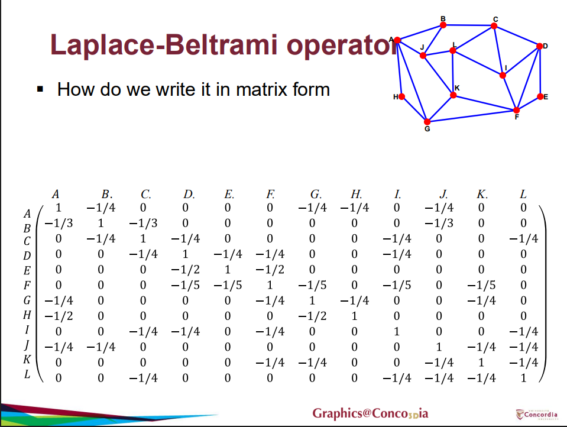

# ArapDeformer

V is a matrix of vertex positions (N x 3), N vertices with position xyz.
F is the matrix of face indices (M x 3), M faces of 3 indices each. The indices referred to in F are indexed into the V matrix.

## What is the Laplace-Beltrami Operator?

In calculus, the Laplace operator measures how much the value at a specific point differs from the average value of its immediate surroundings. The Laplace-Beltrami operator is simply the generalization of this concept applied to curved 2D surfaces (such as a 3D mesh) instead of flat grids. It is represented as an N x N sparse matrix, where N is the number of vertices.

The diagonal entries contain the sum of the weights of all edges connected to a vertex.

The off-diagonal entries contain the negative weight of the edge connecting vertex $i$ and vertex $j$ (or zero if they are not connected).

*Note that this image represents a normalized graph Laplacian, in which the cotangent weights are normalized to sum up to 1. They do not depend on the angle between the edges, as our code does*

We need the laplace-beltrami operator to calculate the **differential coordinates** of a mesh, otherwise known as the shape of the mesh. It allows the user to know the position of every vertex in relation to its neighbours, regardless of where the mesh is in the world.

## Precomputing Static Data

Not everything needs to be recalculated several times per frame. This function calculates all the data that remains persistent throughout the duration of the program.

First, we calcualte the Laplace-Beltrami operator using a built in libgl function.

    igl::cotmatrix(V, F, L_cot);

`L_cot` is the laplace-beltrami operator. It represents the original configuration of the mesh. Since the goal of ARAP is to try to maintain the original shape as much as possible, we need to store this data for future calculations. It will be used to calculate the optimal rotations of vertices, and for solving the global step of the ARAP.

Next we need to calculate the differential coordinates of the mesh, known as delta. They represent the shape of the mesh.

    delta = L_cot * V;

`delta` is an N x 3 matrix (N x N * N x 3 = N x 3). Each N represents a vertex.

Next, we simply allocate some memory for our `precomputed_neighbours` matrix and our `rotations` matrix.

    precomputed_neighbors.resize(V.rows());
    rotations.resize(V.rows(),Eigen::Matrix3d::Identity());

`precomputed_neighbours` is a 2D dynamic array. The outer array is of size N, with index `i` representing vertex `i`. The inner arrays depend on how many neighbours that particular vertex has. If vertex 0 is connected to 6 other vertices, `precomputed_neighbors[0]` will have a size of 6. Each element inside of each inner array are composed of `NeighbourData`.

`NeighbourData` contains the following data:

- `index`: An int (the ID of the neighboring vertex. It is used to look up a neighbouring vertex position from `V_new` and its rotation matrix from `rotations`).
- `weight`: A double (the cotangent weight $w_{ij}$). This represents the "stiffness" of an edge connecting two vertices. These weights are derived from the angles of adjacent triangles. This ensures that no matter how the mesh is triangulated (what shape and what density the triangles are), the stiffness of the mesh will be the same throughout.
- `original_edge`: A 3D vector ($3 \times 1$ vector of $v_j - v_i$) that represents the direction of this vector in the original, not deformed mesh.
- `weighted_edge`: The original edge multiplied by its negative cotangent weight. ($-w_{ij} \cdot e_{ij}$). Will be used to calculate the covariance matrix during the local step.
- `half_weighted_edge`: The original edge vector multiplied by half of its cotangent weight. ($\frac{w_{ij}}{2} \cdot e_{ij}$). This is required to build the target Right-Hand Side vector ($b$) during the Global Step

`rotations` is an array of N 3 x 3 matrices.

Next, we iterate through the cotangent matrix:

    for (int c = 0; c < L_cot.outerSize(); ++c)
        for (Eigen::SparseMatrix<double>::InnerIterator it(L_cot, c); it; ++it)
    
This is a standard way to access a sparse matrix with Eigen. In Eigen, sparse matrices are stored in column-major order. So first, we loop through the columns, and then we access the non-zero rows within that column.

So, now we have a way to access every non-zero entry in the cotangent matrix. Now it is time to grab the relevant data. Refer to the Laplace-Beltrami image if you don't understand why the currentVertex is represented by the row and the neighbouring is the col (although the matrix is symmetric so it actually doesn't matter which is which).

    int currentVertex = it.row();
    int neighbouringVertex = it.col();
    double weight = it.value();

We ignore the diagonal entries:

    if (currentVertex != neighbouringVertex)

Finally, we populate a NeighbourData object with the relevant information and push it into our `precomputed_neighbours` vector.

    NeighborData data;
    data.index = neighbouringVertex;
    data.weight = weight;
    data.original_edge = (V.row(neighbouringVertex) - V.row(currentVertex)).transpose();
    data.weighted_edge = -data.weight * data.original_edge;
    data.half_weighted_edge = (data.weight / 2.0) * data.original_edge;
    precomputed_neighbors[currentVertex].push_back(data);

And thats it! We have calculates all precomputations. Now that we have this, we can move on to the rest of ARAP.

## Populating the Augmented Laplacian

The Augmented Laplacian is the A term in our final equation Ax = b. The original laplacian is non-singular (it is not invertible). So solving for Ax = b with A being the laplacian will fail.

Instead, we need to inject some "real world" into the matrix to tie it to a position in space. By adding a massive scalar value (like 10000) to the diagonal entry of a specific vertex, we are anchoring it to its world position.

Why is this the case? Compare these two equations:

$$-2x_i + 1x_1 + 1x_2 = 0$$

$$(-2 + 1,000,000)x_i + 1x_1 + 1x_2 = 0 + (1,000,000 \cdot \text{target\_X})$$

The solution to the second one will be something around 999,998, meaning that the effect of the neighbouring vertices is insignificant.

In other words, if a vertex has a very large weight, then the weight of the neighbouring edges becomes numerically insignificant. So the result of the linear equation will be approximately the vertex, meaning it will not move when the new positions of each vertex is being calculated.

This also makes the matrix positive-definite, meaning it is invertible!

Alright now lets get into the code!

First, we need to change our cotangent matrix from negative semi-definite to positive semi-definite. All this means is that we want the sum of our weighted edges to equal the diagonal, and we want the diagonal to be positive. LibGL automatically makes the cotangent matrix negative semi-definite, but Cholesky Decomposition, which we will be using, requires a positive semi-definite matrix. So we just flip the signs to match.

    Eigen::SparseMatrix<double> L_system = -L_cot;

Then, as we discussed, for every anchor, we will add that gigantic anchor weight to lock it in place:

    for (int i = 0; i < anchor_indices.size(); ++i) {
        int idx = anchor_indices[i];
        L_system.coeffRef(idx, idx) += anchorWeight;
    }

Next, lets do Cholesky Decomposition ($LDLT$ factorization):

    solver.compute(L_system);

Why we do this: Solving Ax = b is computationally heavy. Fortunately, A remains constant when a vertex is being dragged because it only depends on the mesh topology, the original weights, and which vertices are anchored. It doesn't depend on the new 3D coordinates. So we can depompose it, and then later use back substitution to solve the system very quickly.

All we want to accomplish with this code is create a new system with the new anchors in place.

Finally we do a simple sanity check in case it fails:

    if (solver.info() != Eigen::Success) {
        std::cerr << "Decomposition failed!" << std::endl;
        return;
    }

## Computing Local Step

The Local step looks at the difference in rotation between each vertex's neighbouring edges of the currently deformed mesh and the original one. It then calculates a 3x3 rotation matrix for every vertex based on its neighbouring vectors and stores it in a vector of matrices.

We use multithreading because the vertices don't relate to one another in the loop, so we can run the calculations concurrently:

    igl::parallel_for(V.rows(), [&](int i)

We will need a cross-covariance matrix. This will store the data for how a neighbourhood has been rotated and changed shape.
    Eigen::Matrix3d covariance = Eigen::Matrix3d::Zero();

Here, we loop through every neighbourhood and take the deformed edges from latest changed model. We get the new shape by multiplying the deformed edge by the weighted edge. This comes directly fron the ARAP formula.

    for (int j = 0; j < precomputed_neighbors[i].size(); ++j){
            int neighbor_index = precomputed_neighbors[i][j].index;
            Eigen::Vector3d deformed_edge;

            // Compute the covariance matrix for vertex i by summing over its neighbors
            deformed_edge = (V_new.row(i) - V_new.row(neighbor_index)).transpose();
            covariance += deformed_edge * precomputed_neighbors[i][j].weighted_edge.transpose();
        }
Finally, we do SVD decomposition. Polar SVD factors the covariance matrix into two parts: $S_i = R_i T_i$.

$R_i$ (rotation) is a pure orthogonal rotation matrix (determinant of exactly $1$). $T_i$ (T) is a symmetric positive semi-definite scaling matrix (the stretching).We discard $T_i$ entirely and store $R_i$ in the rotations array.

    Eigen::Matrix3d rotation, T;
    igl::polar_svd(covariance, rotation, T);
    rotations[i] = rotation;

## Populate Target Matrix

This function handles populating the b variable in the equation Ax = b.

Lets just allocate some memory first.

    target.resize(V.rows(), 3);

We can use multithreading again.

igl::parallel_for(delta.rows(), [&](int i)
    Eigen::Vector3d weighted_delta = Eigen::Vector3d::Zero();

Here we sum up the target and neighbour rotation matrice, multiply it by the edge weight and divide by 2 to get the average. This comes straight from the ARAP formula.

for (int j = 0; j < precomputed_neighbors[i].size(); ++j){
    int neighbor_index = precomputed_neighbors[i][j].index;
    Eigen::Matrix3d rotation_target = rotations[i];
    Eigen::Matrix3d rotation_neighbor = rotations[neighbor_index];
    weighted_delta += (rotation_target + rotation_neighbor) * precomputed_neighbors[i][j].half_weighted_edge;
}

Here we store the data. We multiple by a negative because earlier we flipped the sign for L_cot, and we need to balance the equation.
    target.row(i) = -weighted_delta.transpose();

Finally, we just add the weight to the right hand side of the equation.
for (int i = 0; i < anchor_indices.size(); ++i){
    int idx = anchor_indices[i];
    target.row(idx) += target_positions[i].transpose() * anchorWeight; // Apply anchor weight to the target position
}

## Global step (solve least squares)

Finally, we just need to solve the system of equation using least squares.

    V_new = solver.solve(target);

And do a sanity check

    if (solver.info() != Eigen::Success) {
        std::cerr << "Solving failed!" << std::endl;
        return;
    }