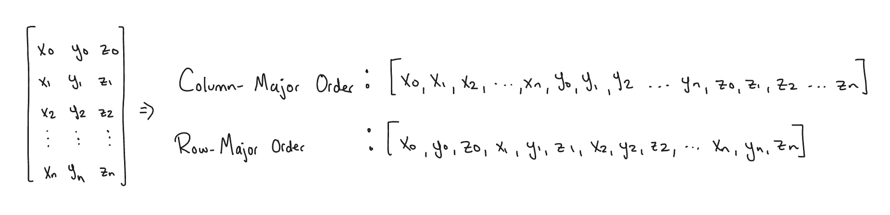

# Implementation

Here is a detailed explanation as to how this particular program runs. I created this because I find it fun and because I want to make sure I fully understand everything so that I can explain it to my friends.

## Memory Layout and Data Storage

I learned during this project that the method in which data is stored is incredibly important regarding performance.

### Row-Major Matrices

Matrices are 2D, but RAM is a continuous block of memory (a giant 1 dimensional array). How matrices are stored in memory has a big impact on performance.

There are two common ways to flatten a 2D matrix into a single array. Column-major order reads columns first, followed by rows. Row-major does the opposite. In Eigen, the default matrix is in Column-Major order. This is proplematic for our performance, which I will explain in a bit.

The CPU (what this program is running on) is very fast, but getting data (such as vertex positions) from RAM is quite slow. To access important information quickly, the CPU has a small bit of memory called **cache memory**. Our imported models (some of which are over 10000 faces) have way too much data to be able to fit in the cache. So, The CPU needs to reach into RAM and grab portions of memory at a time and load it into the cache. This process is costly, so we want to maximize the value we get from every data transfer.

So why do we need Row-Major ordering here?

Certain functions in this project require a scan of every vertex in the model. This means we are looking for xi, yi, and zi for any given vertex. When a **cache line** (a block of memory, say from index 0 to 4) is pulled into the CPU, we want all three coordinates to be in that line so that the CPU can find it at once without having to return to the RAM. It is therefore easy to see how storing our matrices in Row-Major order works out beaufifully for our purposes.

The effects of this optimization can be seen whenever sparse matrices are multiplied together (see ...) and when solving least squares systems (see ...)
